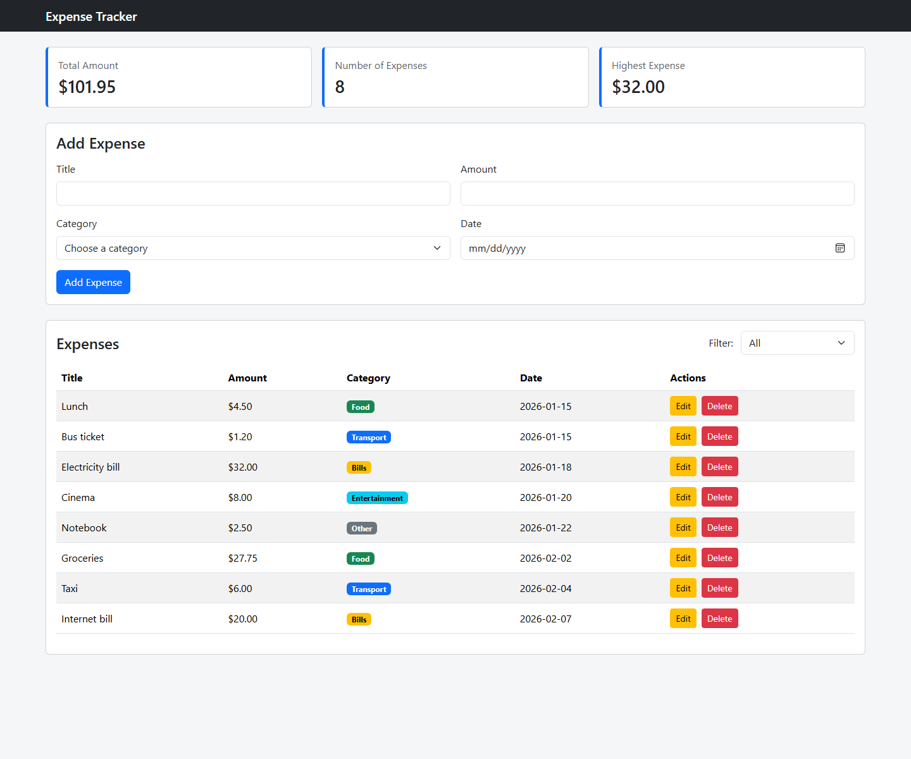
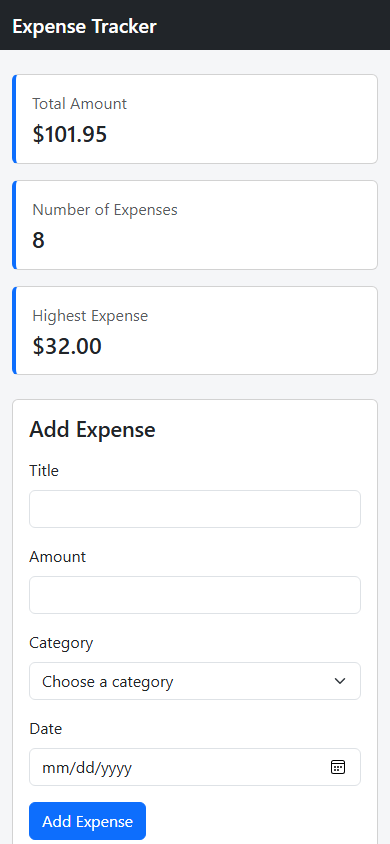
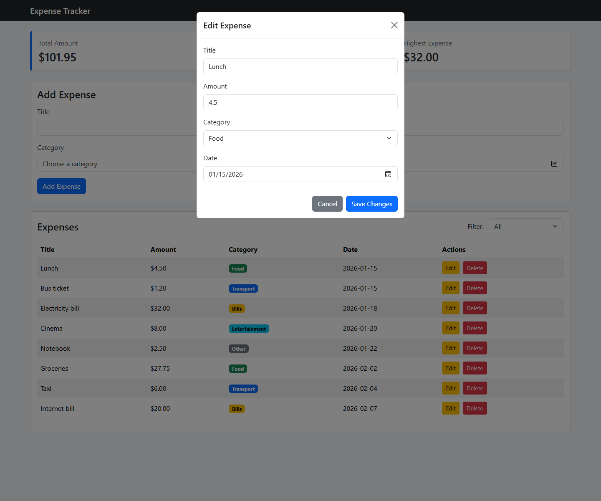

# Expense Tracker

I made this project to keep expenses in one place. I can add, edit, delete, and filter expenses, and the data is saved in PostgreSQL.

## Project Link

[GitHub Repository](https://github.com/Abdalhade22/expense-tracker)

## Demo Video

[Watch the demo video on Google Drive](https://drive.google.com/file/d/1_M3UJCLy_4gKDzoGq67sQKPnViPa_JM7/view?usp=sharing)

## How to run

### Database

1. Create a database named `expense_tracker` in PostgreSQL.
2. Run the `backend/schema.sql` file.

### Backend

1. Copy `.env.example` and rename the copy to `.env`.
2. Write the PostgreSQL password in the `.env` file.
3. Open a terminal inside the `backend` folder.
4. Run:

```bash
npm install
npm start
```

### Frontend

Keep the backend running, then open `frontend/index.html` with Live Server.

## What the project can do

- Add a new expense
- Edit an expense from a Bootstrap modal
- Delete an expense
- Filter expenses by category
- Show the total, count, and highest expense
- Show category badges in the table
- Work on desktop and mobile screens
- Save the data in PostgreSQL

## Screenshots

### Desktop



### Mobile



### Edit expense



## Hardest part

The part that took me the most time was updating the table after adding, editing, or deleting an expense. I fixed it by calling `refresh()` after every change so the page gets the latest data from the API.
